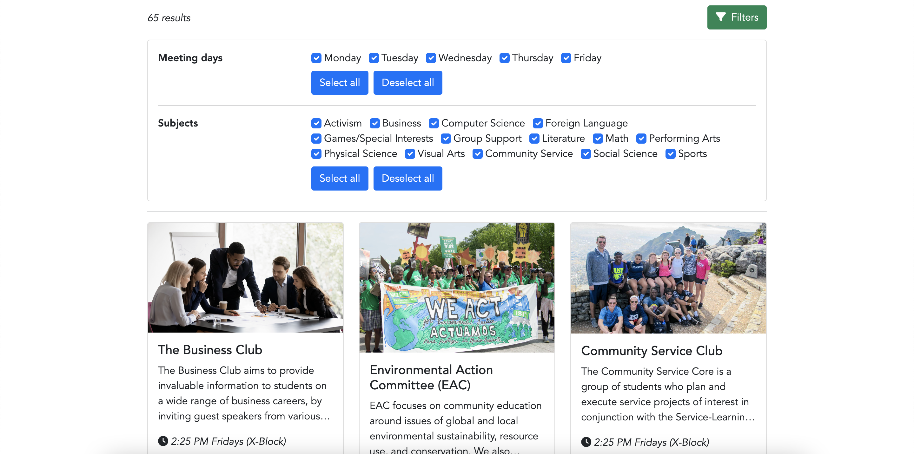
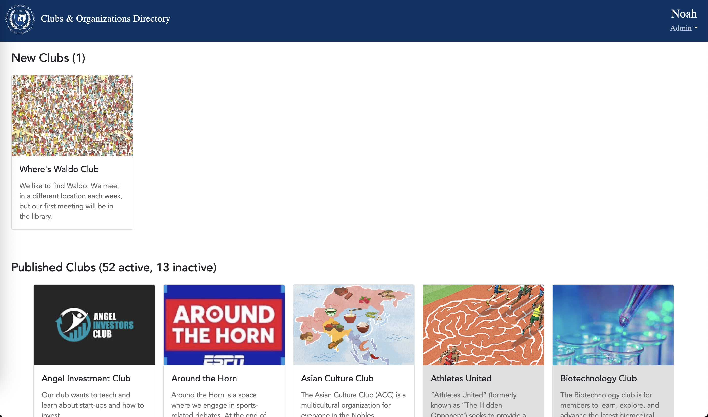

# Nobles Club Directory

The Nobles clubs website — a Vite + React + TypeScript SPA served at
[https://nobilis.nobles.edu/clubs](https://nobilis.nobles.edu/clubs), backed by
Firebase (Auth + Realtime Database + Storage, project `nobles-20183`).
Originally based on the site created by Simon Juknelis '24; rewritten from Vue
in 2026 alongside the Veracross auth migration.

<div align="center">
  <br />
  <br />
  
</div>

## Features

- **Public directory** of active clubs with subject filters and search
- **Membership**: students/faculty join clubs (instant or leader-approved,
  per-club `join_policy`), leaders manage member lists and join requests
- **Events calendar** (FullCalendar) with recurring events; club
  leaders/advisors create and manage their club's events
- **Club registration & editing** with image upload, submitted for admin
  approval
- **Admin portal** (web-only): approve/reject new and edited clubs,
  activate/deactivate, delete
- **Veracross sign-in** via the Firebase OIDC provider (`oidc.veracross`) —
  the same flow as the Nobles app

## Development

```sh
npm install
npm run dev                       # against production Firebase
VITE_USE_EMULATOR=1 npm run dev   # against the local emulator suite
firebase emulators:start --only database,auth,storage
npm run build                     # typecheck + production build to dist/
npm run lint
npm run test:rules                # security-rules tests (needs JDK 21+ for firebase-tools)
```

## Architecture

- `src/data/` — typed Firebase data layer (clubs, members, events, users,
  rrule). **Mirrored into the app repo as `react/lib/clubsData/`** — see
  `src/data/firebase.ts` for the portability contract. Keep the two copies in
  sync.
- `src/auth/` — Veracross OIDC AuthProvider + student/faculty role probe
  (via `theappserver/api/api-token.php` + the Veracross v3 API)
- `src/components/`, `src/pages/` — UI, styled per the app's design guide
  (react/docs/DESIGN_GUIDE.md): EB Garamond display / Nunito content,
  Nobles navy, subject accent colors
- `database.rules.json` / `storage.rules` — security rules, tested in
  `rules-tests/`. Deploy with `firebase deploy --only database,storage`.
  **Note:** `database.rules.json` is the full ruleset for the shared RTDB
  (it includes the app's `/global`, `/leaderboards`, etc.) — the pre-rewrite
  console rules are snapshotted in `firebase-snapshot/`.

## Database layout

```
/clubs/directory/{clubId}            published clubs (join_policy, leaders, advisors)
/clubs/unpublished/{clubId}          submissions awaiting admin approval
/clubs/admins/{uid}                  admin role marker
/clubs/members/{clubId}/{uid}        membership records
/clubs/join_requests/{clubId}/{uid}  pending requests (approval-policy clubs)
/users/public/{uid}                  profile (incl. veracross_person_id) + clubs map
/events/{eventId}                    club events (rrule recurrence, school_year)
```

## Deployment

`npm run build`, then publish `dist/` to the static location currently
serving `/clubs`. Deploy the security rules in the same change window the new
build goes live.
